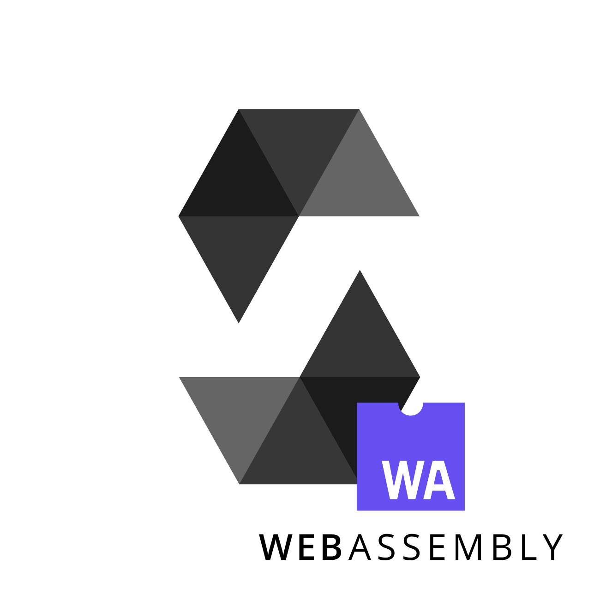

# solang - A Solidity to wasm compiler written in rust

[]



This is solang, a proof of concept
[solidity](https://en.wikipedia.org/wiki/Solidity) compiler. The
[existing solidity compiler](https://solidity.readthedocs.io/) is a huge C++
code base which implements its own parser, optimizer and handling of binary
files.

The idea here is that we use standard tooling like a parser generator, llvm
for its optimizer and handling of wasm binary files and use rust. As result,
only the compiler frontend needs to be written. This will be a much smaller
codebase which is hopefully more maintainable than the existing solidity
compiler.

In addition we will have a solidity compiler which supports wasm, which allows
the ethereum community to move away from the EVM. This, in turn, allows us to
improve the solidity language in ways not easily implemented in EVM, like
string concatenation or string formatting.

## What is implemented so far

This is really just a starting point. So far, we can compile the following
solidity contract:

```solidity
contract test3 {
	function foo(uint32 a) returns (uint32) {
		uint32 b = 50 - a;
		uint32 c;
		c = 100 * b;
		c += 5;
		return a * 1000 + c;
	}

	function bar(uint32 b, bool x) returns (uint32) {
		uint32 i = 1;
		if (x) {
			do {
				i += 10;
			}
			while (b-- > 0);
		} else {
			uint32 j;
			for (j=2; j<100; j++) {
				i *= 3;
			}
		}
		return i;
	}

	function baz(uint32 x) returns (uint32) {
		for (uint32 i = 0; i<100; i++) {
			x *= 7;

			if (x > 200) {
				break;
			}

			x++;
		}

		return x;
	}
}
```

The parser is fairly complete. The resolve/annotate stage and LLVM IR conversion
stage need work.

## How to build

Required:
 - rust 1.33.0 or higher
 - llvm libraries with the WebAssembly target enabled.

To check if your llvm installation has the WebAassmebly backend, run
 `llc --version`. It should list the wasm32 target.

### On Fedora 30, you need:

`sudo dnf install cargo llvm-static llvm-devel zlib-devel clang glibc-devel.i686`

### On Ubuntu 18.10, you need:

`sudo apt install curl llvm git zlib1g-dev`

Then use [rustup](https://rustup.rs) to install the latest stable rust.

## Build your llvm libraries

You will need the llvm libs, compiled with the WebAssembly backend/target.
The output of `llc --version` must include `wasm32 - WebAssembly 32-bit`. If
it does, then `cargo build` will suffice. If not, then follow the steps
below.

The Fedora 29 and Ubuntu 18.04 llvm package does not include this; on Ubuntu
18.10 you are in luck, and you should not need to build your own llvm
libraries.

You need the following dependencies on Ubuntu:

`sudo apt install cmake ninja-build subversion build-essential`

You can run the `build-llvm.sh` shell script to download llvm, compile it and
then build solang. This will place the built llvm in the llvm/ directory.

Once you have the llvm libraries built, make sure you have llvm-config in your
path whenever you execute a cargo command. This will ensure that the right
version is used.

## How to run

For now, solang just parses each command line argument as a solidity file and produces
a *contractname*.wasm for each contract in all solidity files specified.

Run:

`cargo run test/compiles.sol` 

This compiles this contract:

```solidity
contract test3 {
	function foo(uint32 a) returns (uint32) {
		uint32 b = 50 - a;
		uint32 c;
		c = 100 * b;
		c += 5;
		return a * 1000 + c;
	}

	function bar(uint32 b, bool x) returns (uint32) {
		uint32 i = 1;
		if (x) {
			do {
				i += 10;
			}
			while (b-- > 0);
		} else {
			uint32 j;
			for (j=2; j<100; j++) {
				i *= 3;
			}
		}
		return i;
	}

	function baz(uint32 x) returns (uint32) {
		for (uint32 i = 0; i<100; i++) {
			x *= 7;

			if (x > 200) {
				break;
			}

			x++;
		}

		return x;
	}
}
```

And you will have a test3.wasm file generated for the test3 contract in this
solidity contract.

```
$ wasm-objdump -d test3.wasm

Code Disassembly:

test3.wasm:	file format wasm 0x1

Code Disassembly:

00006c <foo>:
 00006d: 20 00                      | local.get 0
 00006f: 41 e8 07                   | i32.const 1000
 000072: 6c                         | i32.mul
 000073: 41 32                      | i32.const 50
 000075: 20 00                      | local.get 0
 000077: 6b                         | i32.sub
 000078: 41 e4 00                   | i32.const 100
 00007b: 6c                         | i32.mul
 00007c: 6a                         | i32.add
 00007d: 41 05                      | i32.const 5
 00007f: 6a                         | i32.add
 000080: 0b                         | end
000082 <bar>:
 000083: 01 7f                      | local[0] type=i32
 000085: 02 40                      | block
 000087: 02 40                      |   block
 000089: 20 01                      |     local.get 1
 00008b: 41 01                      |     i32.const 1
 00008d: 71                         |     i32.and
 00008e: 45                         |     i32.eqz
 00008f: 0d 00                      |     br_if 0
 000091: 41 01                      |     i32.const 1
 000093: 21 01                      |     local.set 1
 000095: 03 40                      |     loop
 000097: 20 01                      |       local.get 1
 000099: 41 0a                      |       i32.const 10
 00009b: 6a                         |       i32.add
 00009c: 21 01                      |       local.set 1
 00009e: 20 00                      |       local.get 0
 0000a0: 41 00                      |       i32.const 0
 0000a2: 4a                         |       i32.gt_s
 0000a3: 21 02                      |       local.set 2
 0000a5: 20 00                      |       local.get 0
 0000a7: 41 7f                      |       i32.const 4294967295
 0000a9: 6a                         |       i32.add
 0000aa: 21 00                      |       local.set 0
 0000ac: 20 02                      |       local.get 2
 0000ae: 0d 00                      |       br_if 0
 0000b0: 0c 02                      |       br 2
 0000b2: 0b                         |     end
 0000b3: 0b                         |   end
 0000b4: 41 02                      |   i32.const 2
 0000b6: 21 00                      |   local.set 0
 0000b8: 41 01                      |   i32.const 1
 0000ba: 21 01                      |   local.set 1
 0000bc: 41 02                      |   i32.const 2
 0000be: 41 e3 00                   |   i32.const 99
 0000c1: 4a                         |   i32.gt_s
 0000c2: 0d 00                      |   br_if 0
 0000c4: 03 40                      |   loop
 0000c6: 20 01                      |     local.get 1
 0000c8: 41 03                      |     i32.const 3
 0000ca: 6c                         |     i32.mul
 0000cb: 21 01                      |     local.set 1
 0000cd: 20 00                      |     local.get 0
 0000cf: 41 01                      |     i32.const 1
 0000d1: 6a                         |     i32.add
 0000d2: 22 00                      |     local.tee 0
 0000d4: 41 e3 00                   |     i32.const 99
 0000d7: 4c                         |     i32.le_s
 0000d8: 0d 00                      |     br_if 0
 0000da: 0b                         |   end
 0000db: 0b                         | end
 0000dc: 20 01                      | local.get 1
 0000de: 0b                         | end
0000e0 <baz>:
 0000e1: 02 7f                      | local[0..1] type=i32
 0000e3: 41 00                      | i32.const 0
 0000e5: 21 01                      | local.set 1
 0000e7: 02 40                      | block
 0000e9: 41 00                      |   i32.const 0
 0000eb: 41 e3 00                   |   i32.const 99
 0000ee: 4a                         |   i32.gt_s
 0000ef: 0d 00                      |   br_if 0
 0000f1: 03 40                      |   loop
 0000f3: 20 00                      |     local.get 0
 0000f5: 41 07                      |     i32.const 7
 0000f7: 6c                         |     i32.mul
 0000f8: 22 02                      |     local.tee 2
 0000fa: 41 c9 01                   |     i32.const 201
 0000fd: 4e                         |     i32.ge_s
 0000fe: 0d 01                      |     br_if 1
 000100: 20 02                      |     local.get 2
 000102: 41 01                      |     i32.const 1
 000104: 6a                         |     i32.add
 000105: 21 00                      |     local.set 0
 000107: 20 01                      |     local.get 1
 000109: 41 01                      |     i32.const 1
 00010b: 6a                         |     i32.add
 00010c: 22 01                      |     local.tee 1
 00010e: 41 e3 00                   |     i32.const 99
 000111: 4c                         |     i32.le_s
 000112: 0d 00                      |     br_if 0
 000114: 0b                         |   end
 000115: 0b                         | end
 000116: 20 00                      | local.get 0
 000118: 0b                         | end
```
Note the optimising compiler at work here.

## Compatibility with existing Solidity code

 * It would be very hard to be compatible with existing EVM `assembly {}` statements,
   these will most likely never be implemented. llvm does support inline assembly,
   so we can (in theory) support wasm inline assembly.
 * WASM does not support 256 bits registers natively, but llvm can generate code
   that implements this. This is much less efficient, and for most uses 32 bit is
   more than enough; I propose we change the default width to 32 bits (possibly
   64 bits since that is also natively supported by wasm?).

## How to contribute/get in touch

Have a look at our [TODO](TODO.md) or find us on the burrow channel on
[Hyperledger Chat](https://chat.hyperledger.org).
