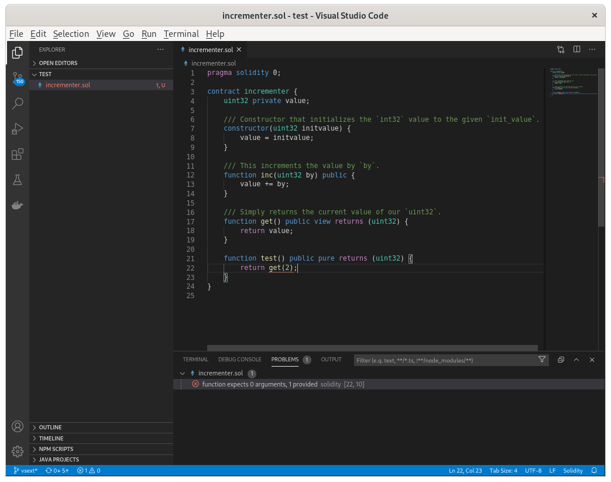
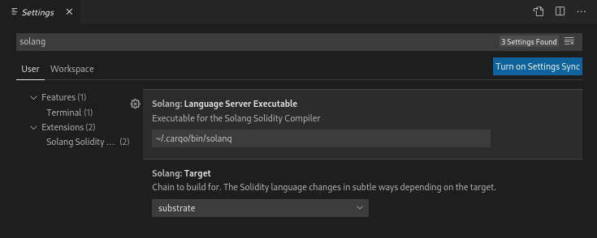

Visual Studio Code Extension
============================

Solang has
a `language server <https://en.wikipedia.org/wiki/Language_Server_Protocol>`_ built
into the executable, which can be used by the Visual Studio Code extension, or by
any editor that can use a lsp language server. The Visual Studio Code
extension provides the following:

1. Syntax highlighting.
2. Compiler warnings and errors displayed in the problems tab and marked
   with squiggly lines.
3. Additional information when hovering over variables, types, functions, etc.
   For example, this will give the struct fields when hovering over a variable
   which is a reference to a struct.

Both the Visual Studio Code extension code and the language server were developed under a
`Hyperledger Mentorship programme <https://wiki.hyperledger.org/display/INTERN/Create+a+new+Solidity+Language+Server+%28SLS%29+using+Solang+Compiler>`_.

Solidity Language flavour
-------------------------

The Solidity language flavour depends on what target you are compiling for, see :ref:`language-status` for a brief overview.

You can choose between the following targets:

solana
   Solidity for Solana

polkadot
   Solidity for Polkadot (Substrate contracts pallet)

evm
   Solidity for any EVM based chain like Ethereum

Note that the language server has support for EVM, but Hyperledger Solang does
not support compiling for EVM.

Using the extension
-------------------

The extension can be found on the `Visual Studio Marketplace <https://marketplace.visualstudio.com/items?itemName=solang.solang>`_.

When started for the first time, the extension will download the Solang binary. Once this is done, it should just automatically work.
Updates are downloaded when made available. However, you should set the blockchain target in the extension settings.

Development
-----------

The code is spread over two parts. The first part the vscode extension client code,
`written in TypeScript <https://github.com/hyperledger-solang/solang/tree/main/vscode>`_.
This part deals with syntax highlighting, and calling out to the Solang language server when
needed. The client needs `npm and node installed <https://docs.npmjs.com/downloading-and-installing-node-js-and-npm>`_.
The client implementation is present in
`src/client <https://github.com/hyperledger-solang/solang/tree/main/vscode/src/client>`_.
The extension client code is in
`src/client/extension.ts <https://github.com/hyperledger-solang/solang/tree/main/vscode/src/client/extension.ts>`_.

Secondly, there is the language server which is written in Rust.
The Solang binary has a subcommand ``language-server``, which starts the
`built-in language server <https://github.com/hyperledger-solang/solang/blob/main/src/bin/languageserver/mod.rs>`_.

Once you have node and npm installed, you can build the extension like so:

.. code-block:: bash

    git clone https://github.com/hyperledger-solang/solang
    cd solang/vscode
    npm install
    npm install -g vsce
    vsce package

You should now have an extension file called ``solang-0.3.3.vsix`` which can be
installed using ``code --install-extension solang-0.3.3.vsix``.

Alternatively, the extension is run from vscode itself.

1. Inside a vscode instance, Ctrl+Shift+B to build the project
2. On the task bar at the bottom of the IDE select Launch Client
3. Open a Solidity file (.sol) to test the extension.

To run the tests:

1. Inside a vscode instance, Ctrl+Shift+B to build the project
2. On the task bar at the bottom of the IDE select Extensions tests
3. The result should be displayed in the debug console of the host IDE instance.
