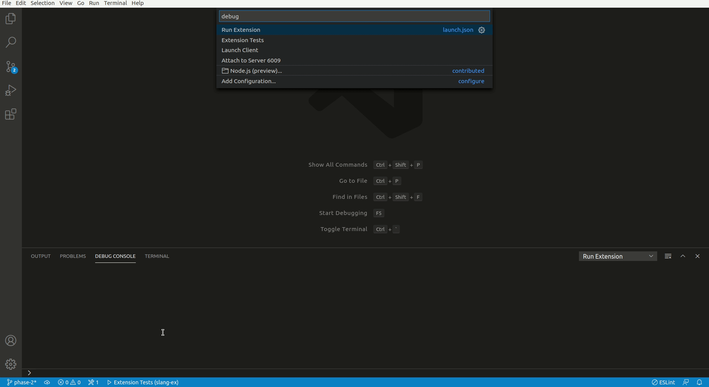

# A Rust based LSP for Solidity using Solang compiler

Currently a WIP project under the Hyperledger mentorship programme.
To know more about the project head towards the [project bio](https://wiki.hyperledger.org/display/INTERN/Create+a+new+Solidity+Language+Server+%28SLS%29+using+Solang+Compiler) the project plan sits [here](https://wiki.hyperledger.org/pages/viewpage.action?pageId=31202927).

## To launch the LSP

### For use

1. Inside a vscode instance, Ctrl+Shift+B to build the project.
2. On the task bar at the bottom of the IDE select Launch Client.
3. Open a Solidity file (.sol) to test the extension.

### For testing

1. Inside a vscode instance, Ctrl+Shift+B to build the project.
2. On the task bar at the bottom of the IDE select Extensions tests.
3. The result should be displayed in the debug console of the host IDE instance.

## Developments till now

1. Syntax highlighting.

2. Bracket completion for Solidity.

3. A minimal LSP for req-response for file operations, hover requests, edits and much more to come.

4. Tests for the commands.

5. [Diagnostics](docs/diagnostics.md)

6. [Hover](docs/hover.md)

## Requirements

For requirements check out the package.json file for dependency and install them using npm.
For LSP server cargo and rustc is a dependency.

## Known Issues

Calling out known issues can help limit users opening duplicate issues against your extension.

## References

Files solidity.configuration.json, syntaxes/solidity.json reffered from https://github.com/juanfranblanco/vscode-solidity

Commit hash: e22c566909a18ae646cbc41ea3e788222c8377a6
 
The MIT License (MIT)
 
Copyright (c) 2016 Juan Blanco
 
Permission is hereby granted, free of charge, to any person obtaining a copy of this software and associated documentation files (the "Software"), to deal in the Software without restriction, including without limitation the rights to use, copy, modify, merge, publish, distribute, sublicense, and/or sell copies of the Software, and to permit persons to whom the Software is furnished to do so, subject to the following conditions:
 
The above copyright notice and this permission notice shall be included in all copies or substantial portions of the Software.
 
THE SOFTWARE IS PROVIDED "AS IS", WITHOUT WARRANTY OF ANY KIND, EXPRESS OR IMPLIED, INCLUDING BUT NOT LIMITED TO THE WARRANTIES OF MERCHANTABILITY, FITNESS FOR A PARTICULAR PURPOSE AND NONINFRINGEMENT. IN NO EVENT SHALL THE AUTHORS OR COPYRIGHT HOLDERS BE LIABLE FOR ANY CLAIM, DAMAGES OR OTHER LIABILITY, WHETHER IN AN ACTION OF CONTRACT, TORT OR OTHERWISE, ARISING FROM, OUT OF OR IN CONNECTION WITH THE SOFTWARE OR THE USE OR OTHER DEALINGS IN THE SOFTWARE.
 
THE SOFTWARE IS PROVIDED "AS IS", WITHOUT WARRANTY OF ANY KIND, EXPRESS OR
IMPLIED, INCLUDING BUT NOT LIMITED TO THE WARRANTIES OF MERCHANTABILITY,
FITNESS FOR A PARTICULAR PURPOSE AND NONINFRINGEMENT. IN NO EVENT SHALL THE
AUTHORS OR COPYRIGHT HOLDERS BE LIABLE FOR ANY CLAIM, DAMAGES OR OTHER
LIABILITY, WHETHER IN AN ACTION OF CONTRACT, TORT OR OTHERWISE, ARISING FROM,
OUT OF OR IN CONNECTION WITH THE SOFTWARE OR THE USE OR OTHER DEALINGS IN THE
SOFTWARE.

## Release Notes

Users appreciate release notes as you update your extension.

### 1.0.0

Initial release of ...

### 1.0.1

Fixed issue #.

### 1.1.0

Added features X, Y, and Z.

-----------------------------------------------------------------------------------------------------------

## Working with Markdown

**Note:** You can author your README using Visual Studio Code.  Here are some useful editor keyboard shortcuts:

* Split the editor (`Cmd+\` on macOS or `Ctrl+\` on Windows and Linux)
* Toggle preview (`Shift+CMD+V` on macOS or `Shift+Ctrl+V` on Windows and Linux)
* Press `Ctrl+Space` (Windows, Linux) or `Cmd+Space` (macOS) to see a list of Markdown snippets

### For more information

* [Visual Studio Code's Markdown Support](http://code.visualstudio.com/docs/languages/markdown)
* [Markdown Syntax Reference](https://help.github.com/articles/markdown-basics/)

**Enjoy!**